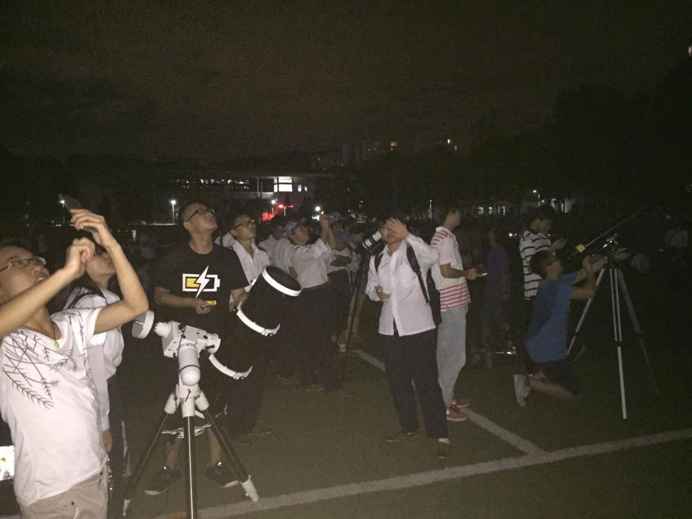
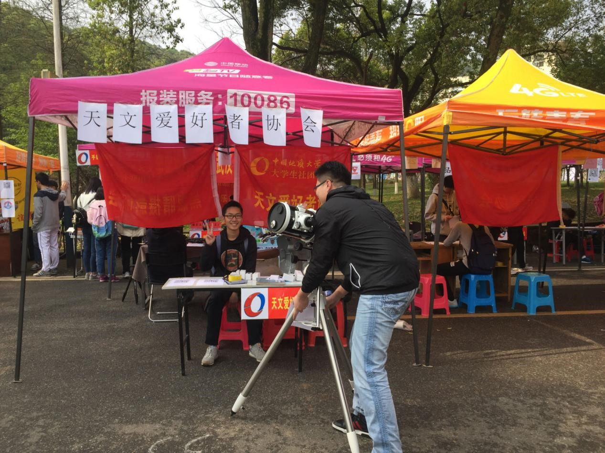

# 2016.06-2017.06

## 作者：万博、刘一飞

### 2015级管理层
- 社长：陈悦璐（地院）
- 副社长：刘一飞（信工）

### 小黑与会徽

在2016年，15级社长陈悦璐提出了为你协购置望远镜的想法，地学院辅导员表示可以先私人垫付，每学期以英才工程拨款的方式偿还陈悦璐垫付的钱。
最终你协花费3000元购买了二手的信达150 mm牛顿反射式望远镜，这就是你协小黑的来历。自这一年开始，你协持续处于负债状态，直至2019年小黑购买款项完全还清。
此外，15级副社长刘一飞为了参加天文论坛设计了现在的会徽，形成了你协经典的黑白配色与猎户座标志（编辑自张璇的补充内容）。

### 司天台➡美食交流群

2016年，剑法自地大毕业并前往紫金山天文台读研，剑法所在课题组负责一个名叫MALATANG的研究项目。之后剑法将自己的司天台群名片改为了麻（Ma）辣（La）烫（Tang）受此启发，
当时的你协众人纷纷效仿，后来在群名片的中间填入美食渐渐成为习俗。每有新人加入，你协众人都会期待有什么样的美食加入进来，从而引发关于吃的大讨论。
美食交流群名不虚传（编辑自剑法的回忆）。

2016年9月15日 中秋赏月盛况

2017年百团，九成新的小黑

## （施工中）
