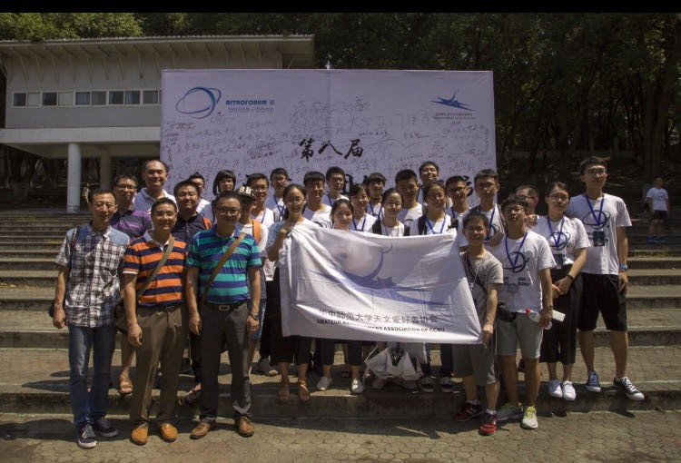
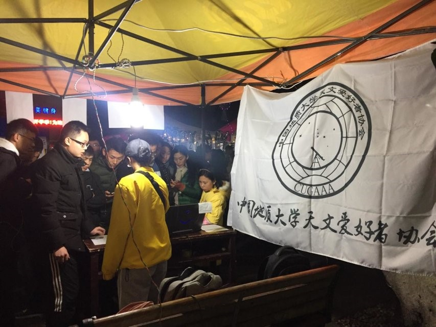
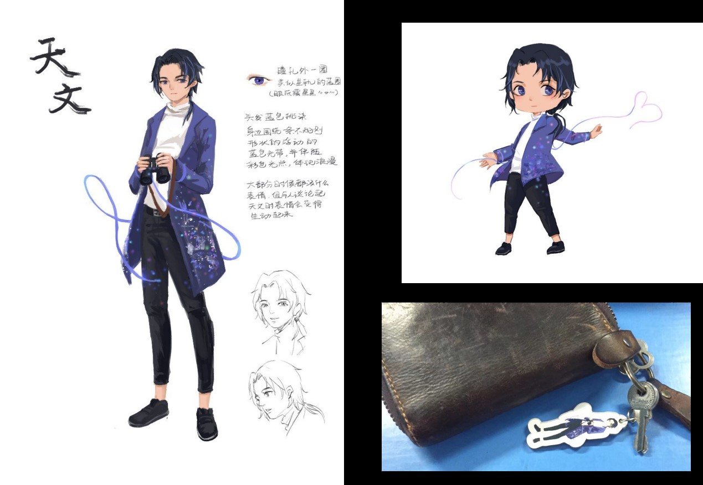
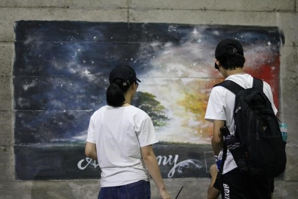
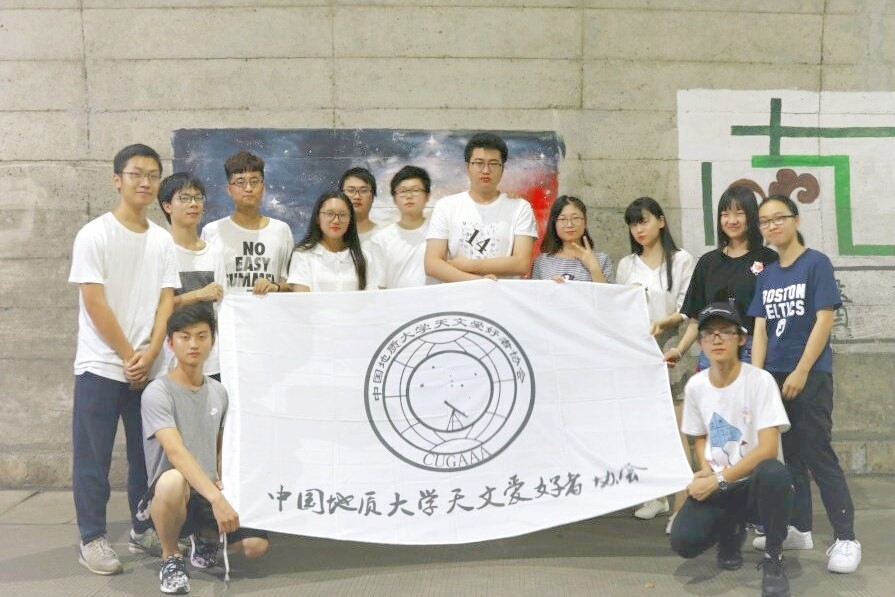
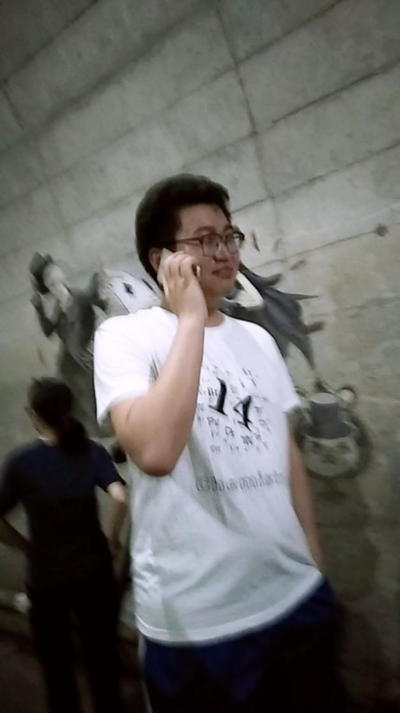
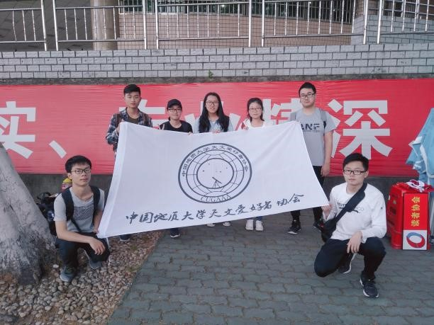
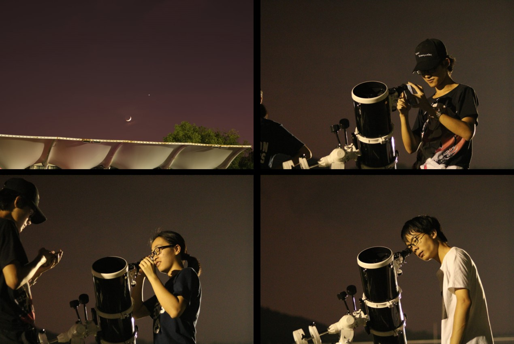

# 2017.06-2018.06

## 作者：刘一飞、廖玉颖、张璇

### 2016级管理层
- 社长：杨枭涵（数理）
- 副社长：区展鹏（数理）
- 学术部长兼技术部长：仲玮（机电）
- 宣传部长：廖玉颖

---

### “鸽协学术交流中心”的建立

2017年暑假，第八届全国天文社团发展论坛在武汉举办。暑假在武汉留守的老鸽子杨枭涵、刘一飞、区（ou）展鹏、仲玮等人遂组建“鸽协学术交流中心”以“为了地大天协更美好的未来，特建立此群共商大事”。
之后鸽协学术交流中心作为老鸽子们的团建场所不断吸纳新鸽子们，后在2018圣诞夜谈后改名为“鸽协情感交流中心”，传承至今。

第八届全国天文社团发展论坛合影

### 协会会旗的诞生

2017年年底，为参加2018年元旦嘉年华，你协在现有会徽基础上赶制了社旗一面，社团名称采用了廖学长认为最适合的叶根友毛笔行书2.0版。这面会旗传承至今。

社旗一瞥

### 晚泊的诞生

2018年，16级社长杨枭涵自费请动漫社设计天协的动漫形象，后天协为铭记14级社长万博的付出将其命名为晚泊。
同年4月，学术部长仲玮负责将会徽和晚泊立绘制作成了徽章和钥匙扣，之后张璇统计并采购了晚泊抱枕，从此大家的归属感加一。

Tip：该会旗由杨枭涵出资定制

晚泊手稿与设计

### 协会的隧道壁画落成

2018年3月，杨枭涵负责请人在隧道画壁画，天协的第一幅壁画诞生，陈嘉镇设计了壁画上的字体，杨枭涵给出了地大天协印章标志。
2018年6月拍了四届同堂的合照。从此开始每年6月换届前后在壁画前拍合影成为你协的惯例，而关于此次合影的种种有趣故事可见于2018年6月26日记仇录。

壁画的创作过程以及两代宣传部掌门（2016与2017）的会晤

合影（时间待补充）

著名照片“安排上了”

### 2018年百团大战
目前仅有照片存世，待补充

2018年百团大战

---
### 记仇录 2018. 06.16
协会历史上第一篇记仇录讲述了2018年6月16日路边的爱恨情仇，此后利用记仇录记录路边天文活动的种种故事成为惯例。

全文收录如下：

2018.6.16   多云

#路边#

博博说让我们三个月搞不了活动，然后今晚就起云了，过几天要下雨。本来想看金星，但是我们还没有架好镜子它就被云挡住了，我觉得肯定不是我们架得太慢的原因。
然后看了木星，四颗卫星也可以看见，期间有人来看。将近十点把镜子往西移，看土星。不过当时云已经起来了，土星在云层中时隐时现，只能看一看皇帝的土星这样子。
后面一飞来了，不过当时已经看不到土星了，再来早一点就ok。期间我们在聊天，聊到哪里哪里人，然后广东小哥哥给杨枭涵唱了他想听的不再犹豫(某广西廖玉颖没听过不会唱)。
22:45收镜子，最后点名批评杨枭涵。
完。

今日苦力:陈嘉镇+熊晋甲+杨枭涵

廖玉颖+张璇打杂and收镜子+一飞来玩😁

天邪记者廖玉颖前线报道

--- 
### 轶事

- 2017年天协延续了路边天文、冬至吃饺子以及社课的传统活动，在冬至灯会，天协的小摊和路边场地都很热闹，陈悦璐和方方土负责着小黑和大黑的对准，
万博在小摊维持星座猜猜猜游戏秩序的同时跟大家科普天文知识，除此之外，只存在群聊里的剑法携家属回来探望天协的各位了（编辑自张璇的补充内容）。

- 故事一则：你协鹰眼，廖学长和叶根友
16级宣传部长廖玉颖别号廖学长。话说某次路边，廖学长穿了一个夹克，带了一个帽子，看起来帅帅的，当时刚好天也黑了，廖学长远远走过来，被误以为是男孩子，好像是被邀请说学长坐这边吧，或者问她学长是哪个学院的。
从此得到了廖学长的雅号。
廖学长有着一双闻名遐迩的鹰眼，能够在西操用肉眼看到天琴座四边形，也可以用裸眼引导小黑对准天体，遂收获荣誉称号“你协鹰眼”。
上文廖学长为天协社旗选择了叶根友字体，而叶根友在后续的海报和周边制作也多次出现。16级社长杨枭涵曾吐槽“为什么这么喜欢叶根友”从此叶根友成为了廖学长的标志之一。

- 故事二则：火流星！
同样和你协鹰眼有关，在你协老鸽子回忆中，廖学长曾在学校内目视到罕见的火流星并在西操原地打滚，张璇社长也可能在路边见过流行。而在编者记忆中下一个确切地在路边目视流星已经是2021年，而再一次则是2023年冬天。
>“鹰眼，火流星，叶根友三个词会想到谁——廖学长”By 张璇社长大人

## （施工中）
