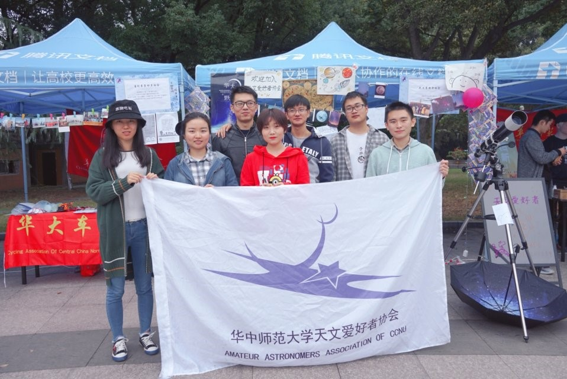

# 2018.06-2019.06

## 作者：廖玉颖、张璇

### 2017级管理层
- 社长：张璇（材化），后半学期变更为刘姝玥（张璇绩点不够）
- 副社长：刘姝玥（数理）
- 学术部长：熊晋甲（工程）
- 宣传部长：陈嘉镇（工程）
- 技术部长：胡世春（资源）

---
## 重要事件

### 重要事件1：购入OR7.7行星目镜：
16级学术部部长仲玮采购了行星目镜OR7.7，这对之后的观测有很大的意义，值得纪念。

### 重要事件2：司天台500人大关：
2018年9月16日，地大司天台群成员突破500人。

### 重要事件3：协会系列周边开发：
2018年11月，宣传部长陈嘉镇设计并制作了宝贵的漂亮的行星书签和星云书签，天协多了一种漂亮的周边。此外18级副社长李梦寒为大家绘制了珍贵的肖像画卡片，大家收到都很开心。

> 李梦寒设计的肖像画卡片

### 重要事件4：2019年百团大战：
2019年3月，大家紧张地为百团大战做准备。学术部长熊晋甲带学术部准备着科普资料，宣传部长陈嘉镇准备了明信片等周边座位礼品，技术部长除了准备百团的路边之外，
协助宣传部长准备材料，其中，奖品月球模型行星盘子以及树叶书签等礼品由陈嘉镇和胡世春采购，并表示无需报销，再次感谢为爱发电的两位。招新小摊秩序井然，
由于展品（陨石，月球仪）、奖品、科普及游戏的趣味性吸引了一大批新成员。

> 2019年百团大战

### 重要事件5：第一次航天日线下摆摊：
019年4月24日，中国航天日。天协诸位为准备付出了许多努力，学术部制作了科普资料以及图书馆前的展板，宣传部制作了精美的书签等礼品，
并协助学术部准备材料，技术部协助学术部和宣传部的同时准备着晚上的观测活动，航天日活动成功收尾

> 航天日实况

> 宣传部、学术部、技术部联手完成的航天日展板

> 航天日合影

### 重要事件6：“鸽协情感交流中心”的成立与圣诞节（编者补）
2018年12月25日晚，鸽协学术交流中心由**某人**（到底是谁？--编者注）的情感故事引发了一次持续至深夜两点的大规模情感经历交流会，
鸽协学术交流中心遂改名为鸽协情感交流中心并沿用至今。

---
## 日常记录
### 日常记录1
2018年9月23日，你协细作们参加了华科的百团大战招新，华科的同志们对细作们表示了热烈的欢迎，并把华科天协的小版徽章送给了细作们，细作们其中聊到了天协的发展和尚珊，
你协的国庆蹭上山计划初步成型。另外记一趣事，在回去的路上，我们决定就在华科里的一家店吃饭，廖玉颖和熊晋甲都选择了辣子鸡丁，然后被辣到不行。熊晋甲辣到只能吃冰块，
廖玉颖辣到觉得吃的不是鸡丁，而是辣椒。用餐完毕后，三人步行回了地大（来的时候骑车来的）。（编辑自2018 9.23天协记仇录）

同是9月23日，你协决定提前一日进行中秋赏月，为天协招到了许多新成员。由于这一天的活动内容很有趣，并且活动记录详实且非常有典型“记仇录”的风格，
编者决定将这一名篇全文收录如下：
> #路边#
> 
>【暨（提前一天）中秋赏月】
> 
>晚七点左右，廖玉颖、熊晋甲、高安童从弘毅堂带来了荧光板，吸引了一批爱好者来为宣传画进行第一轮创作（尽管最后只剩下“地大天协”四个字了）。杨枭涵一个人搬来了镜子（着重表扬），仲玮、高安童、陈嘉镇（划水）齐心协力众志成城把镜子架好了。对好月亮以后，众人开启了座谈会模式。
>
>等到廖学长携湿巾再次驾临操场，李梦寒在第一轮创作的基础上（事实是并没有什么基础）将抽象派的小月亮换成了写实派的大月亮，陈嘉镇在众人提点下，把炮筒改回了小黑，并在空余的地方画下我协会徽里的猎户，并写下了群号，终于在一小时以内完成了创作。对这种坚持不懈的精神提出表扬。在此期间，仲玮和廖玉颖在研究月球灯出了什么问题。
>
>8:30左右咕咕社长带来了月饼，承包了天协众人的宵夜，这一定是漂亮的社长才会做的事情，and一位自称18级的研究生——张生一学弟（？）送来了一袋山楂。至此，场地上大致分为三拨人：一圈天邪老货、一排18级学妹、一堆用肉眼看星星或者用小黑看月亮的热爱星空的同学。前两批主要在吃宵夜，后一批主要在看星星，实在是很有我协热爱食物的传统。P.S.：某同学认为司天台群号是地月距离，而廖玉颖则认为荧光板上画的是地球，点名批评。
>
>不知什么时候开始，天协众人又开始给博博安排上了，并在小黑的目镜盘上膜了起来，博博表示很感动。此时，一位身着红衣的女子，哦不，是女同学突然出现，并询问众人“请问区展鹏在吗？”虽然我们隐约察觉到什么，但并不敢下结论，只好先记上一笔。刘一飞忙里偷闲来操场和我们聊了一下他繁忙的生活，杨枭涵说出了“想和女孩子去唱歌”这样埋藏于心灵深处的欲望，手机没电的熊晋甲开始玩起了廖玉颖的刀男（字面意思）。大概十点多叶非凡也来了（苦力啊啊啊【破音）。就这样吃的吃聊的聊玩的玩，到22:25开始收镜子和荧光板（伴随着瓜分赃物），各自回各自的窝点。完。
>
>最后，没来却非常想来的刘姝玥认为本次记仇录需要写上她的名字。没办法，副社的话还是要听的。
> 
>今日苦力：杨枭涵、熊晋甲、廖玉颖、高安童、叶非凡、陈嘉镇
> 
>今日出席：刘睿萌、李梦寒、周密、耿昊、仲玮、刘一飞、张璇
>
>天协记者陈嘉镇前方报道
> 
> 

## 日常记录2：2018年国庆上山活动

2018年10月8日，16级、17级和18级成员跟随华科武大去大别山观测天龙座流星雨，看到了许多的流星，认识了许多星座，zx的毛毯很温暖（以个人名义出行）。

编者补充：为什么zx社长的毛毯格外温暖呢？因为很多你协成员都是第一次在国庆上山，后半夜的防寒准备并不非常充分（特别是手脚），毛毯成为了大家暖手暖脚的唯一方法，
因此决定通宵的部分鸽子们只能围着毛毯坐了一圈，你踹我一脚，我踹你一脚。就是在这个大家一起蜷缩在毛毯的时刻，编者在zx社长的指引下第一次完成了画出了冬季大花环。

另外除了认识了各种各样的星星根据当天完成的记仇录（2018 10.6-7）还有一些有趣的事情，提供给大家分享：

这次上山zx社长带着大家一起狂炫零食，在酒足饭饱之后，你协众人开始玩起了剧本杀，剧情大致是破解一个作死得罪所有人的大学生公敌惨死在厕所的疑案。
演员们包括入戏太深的社长，想不到自己是凶手的凶手，一顿骚操作结果被指认成凶手的倒霉蛋编者以及一直吐槽自己人设太渣的但投出投出了唯一正确的一票的易婷。游戏进行的过程中，天协众人的人设也随着剧本一起崩坏了。玩完两局推理游戏后，众人表示可以到此为止，并一起去了厕所（在体验厕所杀人案的剧本之后，某些人表达了不想一个人摸黑去厕所的愿望）。

另外在早些时候，你协和华科、财大众人组队玩了狼人杀，在这个过程中：

刘姝玥同学开心地拿到了预言家，然后因为其他玩家错误睁眼而全体交牌。

刘姝玥同学开心地拿到了预言家，然后全体突然起兴想要爬山拍银河而不了了之。

（对此，刘姝玥同学希望这一事件可以出现在记仇录里并对一直玩不到预言家进行谴责）

这就是目前你协唯一一次山上剧本杀和狼人杀体验。

> 你协合影，由于部分鸽子冻了一晚上+爬山看日出，已经极其疲惫，加之拍摄时大家被迫直视着东边的太阳，遂从中诞生了传世经典：地大天协九宫格
> 
## 日常记录3
2018年10月参加华师天协的百团招新并合影。

结束后仲玮，高安童，熊晋甲，周密，刘姝玥，张璇一起看了电影（昨日青空）并一起吃饭。在这个过程中留下了世界名画：两对情侣中间的双重天津四。

看过昨日青空后，大家有感而发，讨论了一下原作漫画以及情感体会，关于恋爱和初恋的种种（或许是情感交流中心诞生的前奏）

2018年10月23日，行星科学研究所官方微博探索那星空帮地大天协宣传路边天文活动。
2018年12月，由剑法出稿，羽祭小兔主播的“萌妹天文”科普音频在地大天协公众号（现已注销）陆续发布，目前共有四期，存于地大司天台群文件

--- 
### 轶事

## （施工中）
