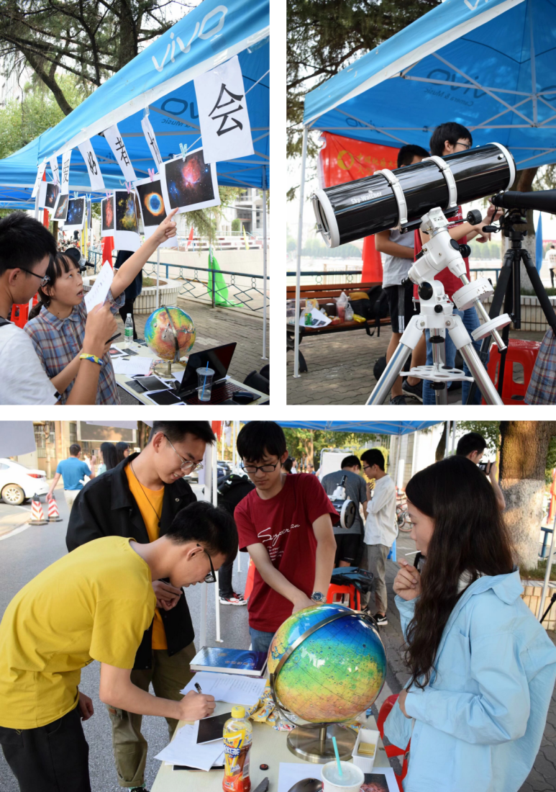
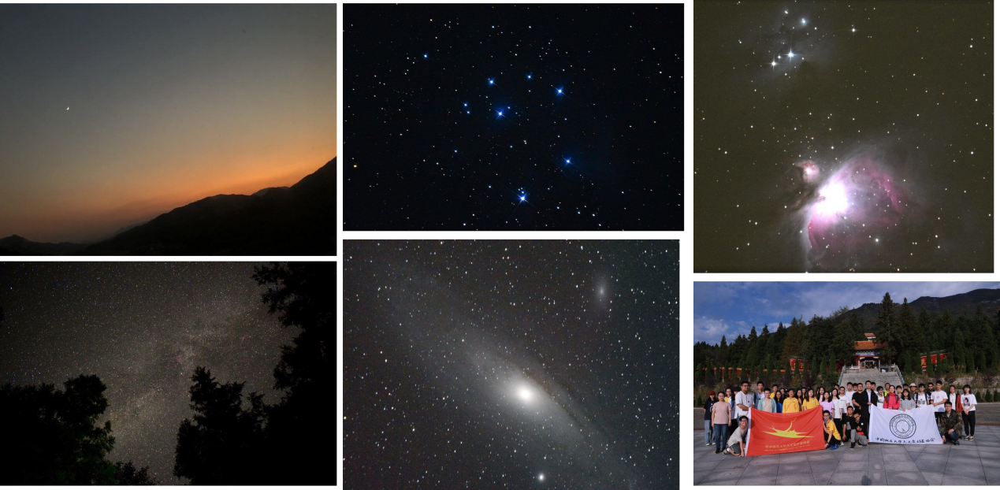

# 2019.06-2020.06

## 作者：周密 高安童

### 2018级管理层
- 社长：周密（地院）
- 副社长：李梦寒（环境）
- 学术部长：高安童（地院）
- 宣传部长：张佳鑫（经管）
- 技术部长：田辰煜（机电）

---
## 重要事件
### 重要事件1：社团文化体验营
2019年9月25日，你协参加了社团文化体验营线下活动。这是2018级管理层负责的首次摆摊活动。由于此时还未招新，各个部门人手不够充足，这次摆摊活动整体沿用了19年百团大战的方案，只对内容进行了一些升级（比如摆出小黑，从行科所借来火星仪）。不过这一次活动让社团的第一次正式摆摊活动从春季学期（航天日+百团）提前到了秋季学期，从而让很多新人更早了解到了天协并加入这个大家庭。这次活动得到了各个年级老少鸽子们的大力协助，并取得了圆满成功，可喜可贺。

### 重要事件2：线上科普
受到武大天协交流群内每日天文科普的启发，学术部决定在新学期开始线上科普连载，效仿武大的方式以QQ聊天的形式在司天台群内通过小天与群友们互动问答。学术部受到BBC纪录片《行星》2019版的启发（编者：非常赏心悦目的纪录片，强推），通过一周左右的时间整理出了地大天协每周天文科普的第一个系列—太阳系诸侯列传。10月开始每周末通过小天逐步更新。在19年6月前共完成了《太阳系诸侯列传》、《心向月球—太空竞赛往事》、《暗黑无界-暗物质与暗能量》、《星之国度游记—中国古代星宿》四个系列。

### 重要事件3：申请社团精品课程立项
2019年12月，社团联宣布开展新开设社团精品课程立项的评选，并为成功立项的社团提供600元经费。已经积累大量了路边天文、线下社课以及线上科普经验（同时也缺钱）的你协自然跃跃欲试。但是此时你协2018级管理层面临十佳社团申报、英才工程材料填写、精品课程立项答辩的三线作战局面。不过在精品社课申报过程中，你协的老鸽子们纷纷伸出援手，为材料填写、PPT制作以及答辩策略给出了很多建议，此处也特别感谢2016级洪鹤庭学长，他通过丰富的学生工作经验为天协的答辩PPT进行了非常细致的指导。你协最终顺利通过精品社课立项，再加上英才工程拨款，你协财务状况大为改善，最终顺利还清了购置小黑的所有欠款。

### 重要事件4：参与空间站实验设计
2020年初，在寒假期间，你协成员因为疫情原因居家赋闲，在肖龙老师的倡议下，你协决定组建一支团队，尝试完成一个向中国空间站（CSS）任务申请的实验载荷设计方案。尽管这个由多个年级，多个学院成员组成的空间站小分队群策群力，但依然难以解决整体方案的具体问题，最终未能完成预期目标。尽管如此，这依然是你协第一次参与严肃的科研项目申报，你协众人收获颇丰。

## 日常记录
### 记录1：面基大会
由于刚刚开学便有很多新人加入地大司天台，跃跃欲试想要体验你协的活动。2019年9月2日，18级管理层组织了有记载的第一次面基大会，本次面基大会主要是为了满足新入学萌新们的好奇心，由你协众人带来了糖果零食（零食文化的传承！），在由技术部部长田辰煜进行了组装小黑的教学，从此在新学期开展面基茶话会成为定式。
（此处应有照片）

### 记录2：2019年的路边
在你协众人的积极合作中，2019年基本保证了1-2周一次的路边频率，并且依靠路边天文活动吸引了很多新人。2019年的路边形式相比2018年变化不大。在此编者依然收录经典记仇录一篇，以供大家感受当时的路边活动氛围。

记仇录（10-9）
part1: zm想抓住夹缝中的一个晴天来路边，于是就办啦。但是六点天上还有厚厚的云，于是众鸽子开始观望，没想到仲伟突然到来作法，霎时间妖风四起风卷残云，只留得地上看傻的周密和天上无辜的皓月。七点，zm来到62栋帮tcy搬小黑，tcy毫不怜香惜玉无情的把钢脚给了zm，点名表扬。

part2 :zm自己架好了小黑，tcy回去拿相机，然后开始日常聊天，gat来了后开始看月亮和木星，发现有大红斑，遂惊呼周密：“噫吁唏，大红斑，吾初见大红斑！速速过来看”，正在和tcy聊相机的zm遂惊跳起，奔望远镜，口中惊呼：“大红斑，吾之大红斑”，片刻，只觉啥也没看到，退而求tcy看，tcy察之，见大红斑，遂与gat笑，齐曰：“非大红斑小，实乃公眼拙，罢了罢了”，zm愧，退。

part3: 然后李景明和张佳鑫接连出现，19级的林雨，杨雨凝等一票小哥哥小姐姐也来了，17级的xjj和cjz先后来到，zm和gat开始组织观星和科普，tcy开始各种拍照（找打），然后gat又又又从他的包里掏出了电脑开始和一票人玩space Engine，zm和tcy等开始尬聊，很快路边天文又又又喜闻乐见的变成了聊天会。十点，北区的小伙伴相继回去，琚苏婷最后过来帮tcy和李景明拆了小黑，最后只留下tcy和ljm相伴在星空下。

感谢出席：周密，高安童，田辰煜，张佳鑫，李景明，仲伟，熊晋甲，陈嘉镇，林雨，琚苏婷，杨雨凝等等
记者tcy前方报道。

### 记录3：2019年的社课
2019年的社课同样十分丰富，不仅按照惯例邀请了张昊老师、黄倩老师以及林恺老师等热心科普工作的老师与同学们交流，也有来自学术部以及技术部同学的科普课程，2019年秋季学期共举办社课6次，其中尤其特殊的是2020年初你协12级元老剑法衣锦还乡，为你协带来的精彩的社课。剑法同时也为你协的学弟学妹们带来了丰厚的天文相关周边。这些都成为了你协成员珍贵的藏品。

>谢谢剑法

### 记录4：国庆上山
2019年国庆你协成员与华师武理天爱们组队上山（个人出行！）。此次上山你协有备而来，做出了比较详细的观测和拍照计划，并根据过往经验提前强调了上山注意事项。此次上山尽管后半夜起云，但依然收获颇丰。目视党们在前半夜看到了M13球状星团，M36至M39疏散星团、M31、M33等星系。而摄影党（以田辰煜等人为代表）也拍摄了M31、M45、M42的大片，成为了你协的经典素材。

### 记录5：日偏食观测
2019年12月还有一次不大不小的日偏食，但这也是一个相对罕见的天象。你协准备了日食眼镜，小孔成像等多种观测方法，完成了罕见的白日路边。

## 轶事
- 轶事1：罗学长  19年某月某日，某位学弟在司天台称呼“18-罗宋汤-高安童”为罗学长，传颂一时。
- 轶事2：周学长  请大家记住在你协“周密”这个名字指的是一个女孩子，谢谢大家。

## 设想中的2020
在秋季学期进行了9次路边和6次社课后，你协众人踌躇满志，准备在春季学期继续大展拳脚。更多路边和社课、清明上山、日食观测、航天日摆摊、百团大战乃至和构想中的与地球科学俱乐部联手的科普活动“天地会”。但是随着2020年新冠疫情的扩散，大学封校，你协为迎接2020年准备的设想遗憾地没有付诸实施。但是在居家时期，你协众人依然进行了“星之国度游记”每周天文科普，以及线上的招新和换届。我们继续期待着重返校园的那一天，我们会回到熟悉的西操，笑看晴天教和阴天教轮流施法。
我们当然会做到。

## 最后是来自作者周密和高安童的总结
周密：虽然在管理社团和组织活动的过程中，我们遇到了一些问题甚至有时候会有一些矛盾，但大家都是为了共同的目标——让你协更好！值得骄傲的是，你协在我们手中还清外债，并开始实现社团经费富余。
高安童：社长大人说得对。
