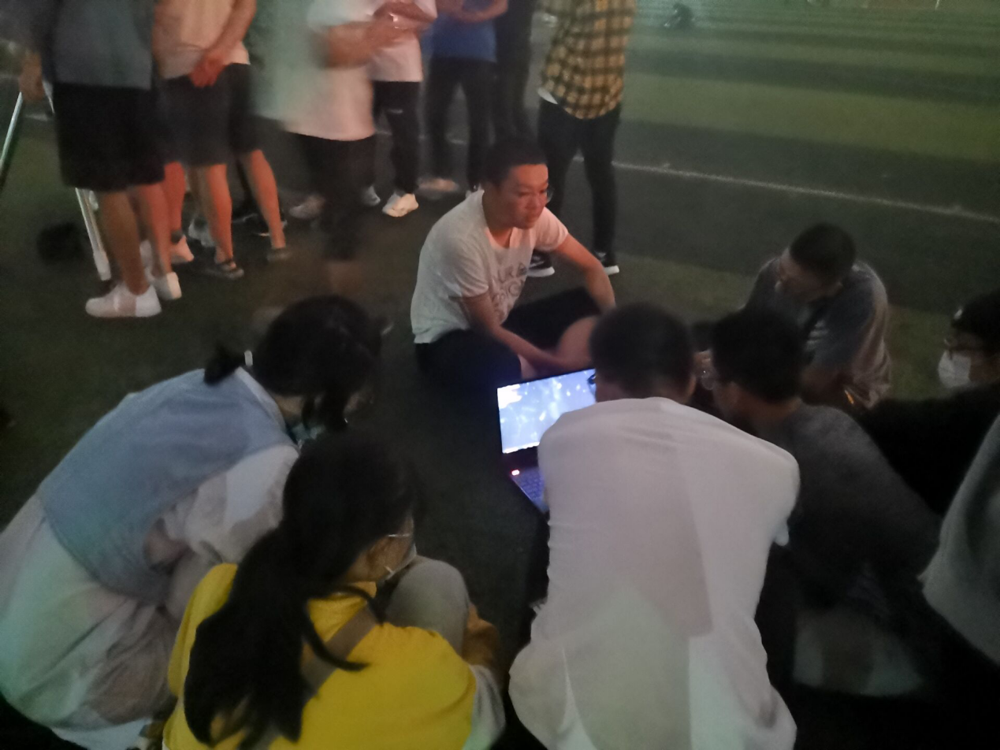
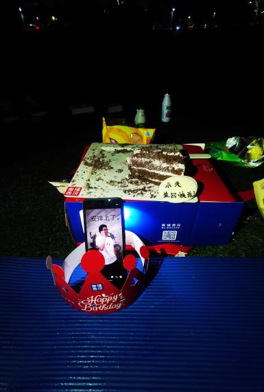

# 2020.06-2021.06

## 作者：孙家淮 高安童

### 2019级管理层
- 社长：韩浏（艺媒）
- 副社长：谷思莹（地信）
- 学术部长：琚苏婷（数理）
- 宣传部长：张浩政（自动化）
- 技术部长：孙家淮（地学院）

天协在19级的一个重大转变是由“欠钱”转为“节余”！上届社长周密为社团申请了英才工程，在2020年底拿到了英才工程结余的500元，还清了之前买小黑还没还完的钱，并且还有剩余。同年宣传部孙家淮也为社团申请了英才工程，同样拿到了500元，2021年年底拿到结余500元。并且更重要的是，这一届社团拿到了校十佳社团，有了1500（好像是这个数字，有点忘记了）的奖金。自此，天协彻底富了起来。（后面十佳社团的奖金好像是需要报销的，技术部买了一些东西，我没有经手，不大清楚有哪些东西）。

## 重要事件
### 重要事件1：地院宣讲与全国科普日摆摊
2020年9月，天协地院新生宣讲，由于韩浏社长给力的宣讲(以及鸽协情感交流中心的后援），这届通过招新找到的人非常多，足足有60多人，应该是迄今为止招新最多的一届吧（有一说一，大多都是鸽子，但也招到了后面20级社长孙嘉奕这样的社团顶梁柱）。

2020年9月，由地学院牵头，与地球科学俱乐部、逸夫科普讲解队一起参与科普日摆摊，由地学院和地球科学俱乐部负责宣发。天协展出嫦娥三号模型，科普了行星探测的相关知识并由学术部部长琚苏婷设计了不同难度梯度的知识问答。这是社团史记录中的首次科普日摆摊，从此成为了天协九月的例行摆摊科普活动。

>雨中的三代同堂

>19级学术部部长琚苏婷设计的“中等难度”题目，编者表示要长脑子了

### 重要事件2：中秋赏月（第一次社团成员面基大会）
在2020年中秋节，因为当时还没正式开始社团活动，所以你协以个人名义用小黑看月球。
因为赶上新生军训结束，所以人巨多。依稀记得高安童师兄周围围了非常多的人。（最开始社长韩浏想和汉服社一起办中秋赏月，但是后面因为一些原因就没一起，但是后面举办活动的时候汉服社的也来了。）（编辑自孙家淮的记录）
编者按：或许是阴差阳错，或许是从居家隔离时代回归的压力释放，2020年的中秋活动显得尤为盛大，原本的路边天文活动在后半程已经演变成了“司天台”群友面基大会，并留下了宝贵的合影，从此开始，在新学期的第一个月末，在社团完成注册的第一次路边活动（或者中秋路边）举行路边、科普、茶会于一体的面基大会成为你协定例之一。

以下附该日完整活动记录：

2020.09.30    晴
#路边观测#
这是卑微小谷第一次写活动录（记仇录），也是第一次参加天协的路边观测（流放新校区的可怜娃子）。因为明天的天气不好，所以就把本来应该在中秋节的赏月变成了今天（而且操场的大灯也没有开）。另外，今天还是迎接大一新鸽子的一天，怀着忐忑而激动的心来到了西区操场中央，果然见到了小黑旁边站着的“大大小小”的鸽子们，在社长大大的介绍下终于和天协的“网友”们见面成功（因为有些事情来到比较晚，没有见到小黑被架起来的场面，小难过），在周密学姐，田辰煜学长调试望远镜位置的时候，陆陆续续又有许多鸽子们来了，大家一起排队看月亮和木星和火星（煤错，看到了木星和火星！！！！）社长大人还给我们大家分了糖果（开心。jpg）。

>（排队观星的鸽子们）

也许是我们的活动过于精彩（没有也许），吸引来了许多大朋友和小朋友，纷纷加入了天文探讨中来，周密学姐和琚苏婷小姐姐宛如保护孩子的母亲般的保护小黑（不是）。过了一会，高安童学长打开了他的笔记本，又到了日常的天文科普的时间啦，大家将学长“团团围住”，认真听着他的科普。

>（学长的科普时间）

大概到了九点二十的时候，进行了新老成员的“见面会”，围成一圈做了自我介绍，感觉这届大一新鸽子有不少未来城校区的（不错不错）。（在此感谢琚苏婷小姐姐和社长大大对我的关心）
今天是非常快乐的一晚呢，嗨皮。
参与本次活动的鸽子：周密，田辰煜，高安童，江博源、丁乙、杨怡霄，齐登李，韩浏，熊晋甲，琚苏婷，谷思莹，张浩政，孙家淮，孙葆华

### 重要事件3：地大司天台群友突破千人
继2018年9月司天台突破500人后，2020年10月30日晚20：57，地大司天台迎来了第一千位群友。从建立到第500位群友，你协用了4年，而从500位到1000位群友，你协了两年（至于为何4年后的司天台只有1200人，详情见2023年社团史）。

### 重要事件4：太阳系全家福
经由多日多器材的观测，在技术部常青树田辰煜、大佬丁乙、大佬刘劼以及你协成员的配合下，成功获得太阳系全家福照片，并被林恺老师放在他的通选课上为我们打广告。这幅天时地利人和造就的作品成为了你协的传世经典。

### 重要事件5：提前8年的十佳社团
2020年11月30日，天协时隔多年闯入了十佳社团的最终评审答辩。但在这一时刻，你协19级管理层恰好均有较为紧急的个人事务。因此编者（临危受命）代替社长进行了答辩。经过了你协多届成员的不断努力和积累，尽管编者的答辩并不完美，但是你协依然久违地（时隔8年以上）获得了这一荣誉以及（更为重要的）的1000元奖金。
你协2018年年初制定的“十年计划”目标，在两年后成功达成。

### 重要事件6：百年难遇的土木相合
2020年12月22日，土星与木星在夜空中近距离相会，用肉眼观测甚至无法将两颗行星区分开，而stellarium的天球上“本”星名场面也流传一时。上一次这样程度的土木大合要追溯到1623年，而下一次土木大合则要等到2080年。为了这百年难遇的惊奇天象，你协在冬至时分罕见地摆出了双镜路边（林恺老师的C925以及小黑），一台用于摄影，一台用于目视。在老师们、你协鸽子们以及晴天教的全力配合下，记录了这一难忘的画面。

### 重要事件7：小黑赤道仪GOTO升级（第一代）
2020年11月初，在你协技术部2020级新锐丁乙dalao以及刘劼dalao的推动下，你协成功对小黑原装EQ3赤道仪进行了第一次升级，加装了带有导星与自动追星功能的GOTO电跟，在之后的尚珊活动中，新的电根系统表现良好（？）。你协的观测能力和摄影能力更上一层楼。

### 重要事件8：小推车（第一代）
在2019级宣传部部长孙家淮的推动下，你协购置了第一台平板车用于搬运小黑。你协苦力状况得到一定的改善。

### 重要事件9：你协群机器人（第一代）
你协2019级社长韩浏为司天台引入了第一代群机器人“白鸦”，能够进行基本的对话互动，随机发送天文摄影图片，整合了先前的每周天文科普内容（还能够点歌），开创了你协线上活动内容很好的先例。

### 重要事件10：小天的成人礼，天协的18岁
2021年4月，小天18岁了，为了庆祝他（她？）的成人礼，也是为了弥补上一年线下庆生企划没能进行的遗憾，你协决定为小天购买黑森林巧克力蛋糕，像你协会徽的猎户座一样插上蜡烛，唱生日歌，吃蛋糕！（当然，远在异国的博博也安排上了）。这是社团史记录里的第一个小天庆生party，这一活动同样延续至今.

 

### 重要事件11：路边地点转移，告别操场中圈
2021年4月30日，编者在观摩武大天协活动后，提议将路边活动地点自西区操场中圈转移至西区操场西北部跑道拐角附近。在此之后，除了内部茶会与party，天协暂别了沿用多年了传统路边地点。虽然新的地点视野较中圈稍差（也更嘈杂一些），却能让没接触过天文和你协的朋友们更容易被路边观测活动所吸引，路边的招新宣传属性更为突出。自此这里成为你协和小黑的新家。

## 日常记录
### 记录1：2020年的路边
2020学年路边是天协在传统活动地点“西区操场中圈”的最后一年，也是在新路边地点活动的第一年。在延续先前活动传统的同时，这一年对于路边活动的内容进行了很大程度的改进。在技术层面，2020级丁乙刘劼两位dalao的加入让技术部得到了明显的补强。在各位技术部鸽子的推动下，小黑得以进行电跟与CMOS相机升级。同时在林恺老师的大力支持下，你协得以在路边完成一系列在很长一段时间内无法完成的摄影佳作。此外，琚苏婷领衔的学术部展现了很高的科普热情，20级部员的加入极大地补充了学术部科普人选。此外编者作为学术部成员在这一年开始尝试使用天文模拟软件Space Engine进行科普，个人认为取得了不错的效果。宣传部在2020年冬季也留下了相当完整的记仇录以供社团史参考（春季记录缺失，不过问题不大）。

>技术部dalao们正在进行“太阳系全家福”中木星的拍摄

>学术部的Space Engine路边天文科普

以下同样完整摘录典型记录一篇，以供大家感受2020学年社团活动的氛围：

2020.10.29   晴
＃路边天文＃
    因为周四晚上许多人有课，路边天文活动推迟到大家下课后进行，很多小伙伴下课匆匆赶过来真的是十分辛苦呢。
但今晚的天气不是十分理想，只能看到月亮和金星(可能是月亮太亮了？)。c11似乎也需要调试。这些都不能打消2位20级大佬拍星星的热情，大佬们手动找到金星并进行了拍摄，不过效果不好当然是意料之中。
另一边高安童学长带着萌新们稍微认了一下星座，然后又讲了一遍宇宙/星星演化史（据说是第三遍了？不过我确实是第一遍听2333），简单易懂还很生动。听到学长以前进行的观星活动之后，我最期待的还是以后能有机会看到星云，它在我心中一直十分神秘。再后来就是用软件模拟我们想看到的各种星星的运行轨迹以及演化，三体问题大家都十分感兴趣呢。活动虽然相较以往进行时间不是很长，但大家仍然十分开心。就记到这里啦。

今日出席：高安童 房敬阳 孙嘉奕 丁乙 陈肃炜 熊晋甲 田辰煜 刘劼 周密 袁亚琳 陈木子（群里没有改备注的小可爱对不起没标上，再次道歉）
记录：陈木子

### 记录2：每周天文科普的整理与延续
在2020学年，学术部与宣传部继续通力合作，继续延续每周天文系列，整理了先前的《太阳系诸侯列传》《星之国度》系列。并以微信公众号推文与QQ空间形式连载。2020年11月，每周天文推出新系列《太阳系著名景观》，在地大司天台以小天发消息的形式更新。2021年4月，宣传部推出每周天文摄影系列，主要由田辰煜、丁乙、刘劼供稿。

### 记录3：社课
2020学年共进行社课五次，内容如下：
2020年10月29日，技术部部长张浩政主讲社课，题目是基础天文观测器材原理与使用介绍
2020年11月，邀请林恺老师做社课——《引力波与引力探测》
2020年12月12日，科普社课，高安童学长主讲《嫦娥五号和天问一号的那些事》
2021年3月18日，社团科普课程，学术部部长琚苏婷主讲《天文漫谈》
2021年5月，社团科普课程，高安童学长主讲《宇宙的历史与未来》

### 记录4：百团
2021年3月，天协参与百团大战，展出各类行星仪，推出猜星图等游戏

### 记录5：外联
2021年3月，应复旦大学天文协会邀请，帮其宣传高校天文摄影大赛。
2021年3月，社团联推出社团拾光，专访天协，由宣传部部长孙家淮代表社团接受采访
2021年劳动节尚珊（四校联合尚珊，迄今规模最大的一次）

## 轶事
- 轶事1：左拥右抱的周密学长
- “孙嘉奕学妹和陈木子学妹都是周密学长的翅膀”
- 
- 
- 轶事2：UNO！
- 对于2021年4月10日的社庆，（似乎是）编者第一次提出在你协推广UNO这一朋友游戏，从此拉开了你协桌游副业的序幕（不务正业的开端？）。
- 

## 作者总结：
这一年里，由我经手帮社团买了小推车，自此解放了鸽子部分人力。同时在地球日期间我帮社团买了很多明信片、书签、笔等，用来社团摆摊游戏礼品等，这一部分的钱是何琦老师给报的账。
我是根据小天发过的宣传说说写的这些事件，很多细节我记得不是很清楚。包括当时社长韩浏有设计过小天形象，但是我换手机+换电脑，实在找不到一些记录了。
我们这一届有传承天协之前的传统，也有一些创新的地方。我没有写其他部门的一些事并不代表他们在划水。小天这一年的每周天文没有断过，这也得益于学术部。技术部就不说了，日常路边以及这一年给出了很多优秀的天文摄影。当时社长韩浏也一直承担着对外交流、统筹社团活动等一系列事情。副社长那边负责新校区的活动我是不是很清楚，但是我记得谷思莹每次我们在南望山摆摊时都会回来帮忙。我记不得的一些东西琚佬可以补充。

编者按：和过往告别
作为更老一届的你协鸽子，或许可以提供一些其他的感想和思考。2020年上半年的居家隔离时期对你协的各种安排计划造成了无可挽回的影响和遗憾。一般来说，你协会在春季学期将更多事务转移给新成员来锻炼和积累经验，但是2019级的鸽子们没有这样的机会，他们就这样接过了社团传承的责任。在新学期开始前的时间里，老鸽子们中一直有着“这样是否太勉强他们”，“天协是否会面临青黄不接”等各种疑虑。但毫无疑问，在2019级管理层的领导下，在各级成员的协同努力下，2020学年的你协焕发了全新的生命力，做到了许多先前难以想象的事情，并为后来数年的活动开创了许多先例，令人眼前一亮。在这里，编者希望再一次感谢所有在这一年里为天协辛勤付出的鸽子们。

另一方面，从编者的视角，2020学年是一个复杂的节点。2021年6月，在又一次快乐的聚会之后，我们送别了2017级的学长学姐们。他们是编者记忆里那些在操场中圈给我们讲故事的鸽子们中最后一批暂别你协的。从此向前，编者作为2018级鸽子才发现，已经鲜有人还会像记忆中那样称呼我们“学弟学妹”，我们早就变成了给新鸽子们讲故事的“学长学姐”。悄无声息中，即便那些在操场中圈留下的记忆如此鲜明，分别的时刻也已经临近。
而恰好也在这一年，你协将路边地点从充满回忆的操场中圈转移到了现在地点。这件事情应该并不算什么重大事件。但是在2024年的时间点回首望去，不知为何，编者却开始感到百感交集。
为了学长学姐传递给我们的“让更多人和你协一起玩”的理念，我认为改换路边地点是顺应发展趋势的变化。在新的位置，我们能被更多人关注到，我们会吸引更多人加入我们，路边会变得更热闹，最后，天协也会变得更加外向和活泼，会变得更好。
不过偶尔，编者还是会一个人躺在操场中圈，看着月亮，数着星星。
因为想继续在这里听学长学姐们讲故事的心情是没有变的。
